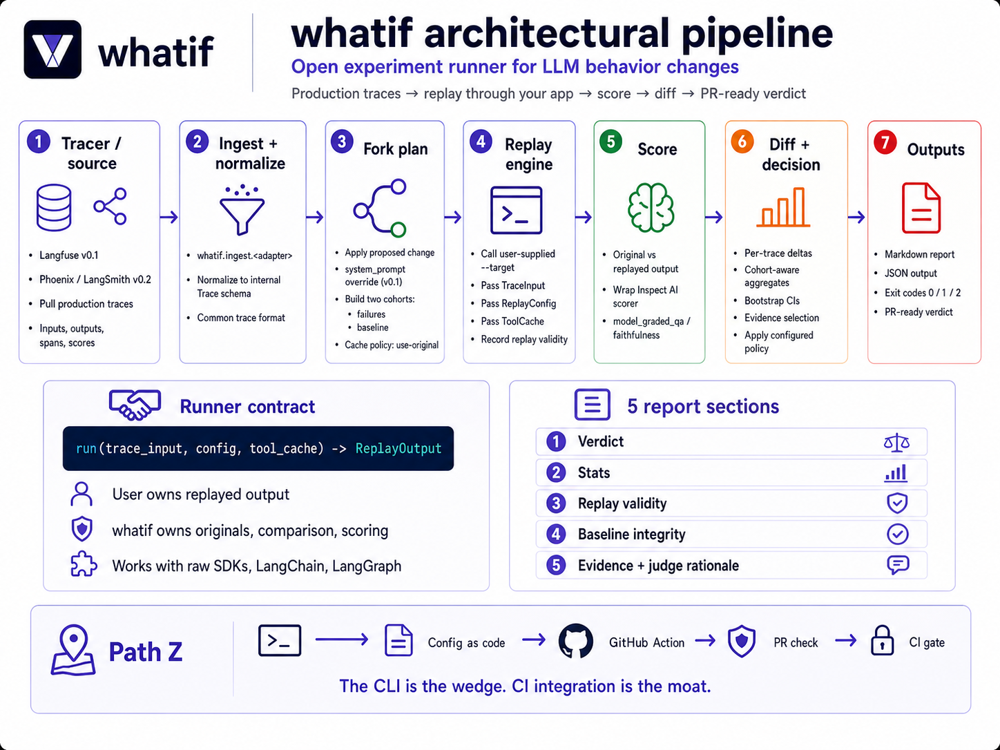

# `whatif` — DESIGN

> **whatif is the open experiment runner for LLM behavior changes.** It pulls real production traces from your observability stack, replays them through your app with a proposed change, uses cached tool results to avoid side effects, scores before/after behavior, and emits a PR-ready verdict report with coverage, replay validity, and concrete evidence.
>
> v0.1 ships as a CLI. v1.0 destination is the **pre-merge regression gate for LLM behavior** — the `pytest` of agent prompt changes. Apache 2.0.

---

## Problem

When an engineer proposes a fix to an LLM system — a prompt, a model swap, a tool tweak — there is no defensible way to answer whether it actually improves behavior. The current workflow is manual, small-sample, and non-reproducible: a handful of cherry-picked traces, inconsistent evaluation, no statistical confidence. The cost shows up as production regressions, slow iteration, and arguments that get re-litigated in every standup.

Every step has a tool. The **production-failure experiment is still fragmented, platform-bound, and hard to trust from a PR.**

**The honest reading**: the workflow exists in pieces inside closed platforms. Nobody offers it as an open, CLI-native, tracer-neutral primitive that emits PR-ready verdict reports. That's the wedge — not "first to do this."

## Why now

- Agents are entering production at hundreds of teams in 2026; "did my prompt change regress something" is a daily question, not a weekly one.
- Tracer ecosystems (Langfuse, Phoenix, LangSmith, OpenLLMetry) have stabilized enough for read-only ingest.
- Inspect AI / RAGAS provide credible scoring substrates to wrap.
- Pre-merge eval gates are becoming standard practice — but the production-trace-driven version is fragmented across closed platforms.

## Prior art (honest, after fourth re-evaluation)

The earlier drafts of this doc claimed nobody tests proposed fixes against production failures. **That is not defensible.** Multiple platforms ship parts of this:

| Tool | Trace ingest | Prod traces → experiments | Replay w/ new config | Score diff | PR-ready output | Tracer-neutral | Open + local CLI |
|---|---|---|---|---|---|---|---|
| **Braintrust** | ✓ | ✓ "trace-to-dataset" | ✓ via experiments | ✓ | ✓ block bad releases | partial / product-bound | ✗ (SaaS) |
| **Langfuse** | ✓ | ✓ experiments (Apr 2026) | partial (prompt experiments) | partial | ✗ (no PR-native) | ✗ (Langfuse traces) | ✓ OSS, no CLI focus |
| **LangSmith** | ✓ | ✓ backtesting cookbook | ✓ | ✓ | partial | ✗ (LangSmith) | ✗ |
| **Promptfoo** | ✗ goldens only | ✗ | n/a | ✓ | ✓ best CI ergonomics | n/a | ✓ |
| **Inspect AI** | ✗ offline | ✗ | n/a | ✓ | partial | n/a | ✓ |
| **AgentOps** | ✓ | ✗ (time-travel replay only) | ✗ | ✗ | ✗ | ✗ | open SDK |
| **Datadog LLM Obs** | ✓ | partial | ✗ | partial | ✗ | ✗ | ✗ |
| **Arize Phoenix** | ✓ | ✓ (eval traces, log to UI) | ✗ | partial | ✗ | partial (OpenInference) | ✓ |
| **`whatif` (proposed)** | ✓ | ✓ | ✓ | ✓ | ✓ | ✓ | ✓ |

That table is what gives the differentiator below its shape: not novelty in any single cell, but the combination of all four right-hand axes (open + CLI + tracer-neutral + PR-ready) — which no row owns together.

## Differentiator (the actual wedge)

Four axes, all required:

1. **Open** — Apache 2.0; nothing locked behind a SaaS or a single vendor's stack.
2. **CLI-native** — driven by config-as-code and exit codes; runs on a laptop and in CI without ceremony.
3. **Tracer-neutral** — bring your own tracer (Langfuse v0.1, Phoenix / LangSmith / OTel-GenAI in v0.2). Adapter interface is small.
4. **PR-ready** — Markdown verdict report + JSON machine output + exit codes. Designed to be a PR check, not a dashboard tab.

Existing platforms own *some* of these axes. None owns all four together.

## The product (v0.1)

A single CLI invocation:

```bash
$ whatif fork \
    --source langfuse \
    --target "python:my_agent.replay:run" \
    --failures "score-below:0.6,since:24h,limit:20" \
    --baseline "score-above:0.8,since:24h,limit:20" \
    --change "system_prompt=prompts/v3.txt" \
    --tool-cache use-original \
    --score "inspect_ai:faithfulness" \
    --report ./reports/$(date +%F)-prompt-v3.md \
    --json   ./reports/$(date +%F)-prompt-v3.json \
    --fail-on-regression

# exit 0 = passed configured policy
# exit 1 = failed configured policy
# exit 2 = inconclusive (setup/replay/scoring failure)
# whatif enforces *your declared policy*; it does not certify "safety."
```

Two things in this invocation that earlier drafts missed:

- `--target` — the **runner contract**. A trace alone is not executable. The user supplies the entry point that reconstitutes their agent for a given trace input + modified config.
- `--baseline` — a second cohort of *previously successful* traces. Without it, the experiment optimizes for fixing failures while silently regressing successes.

## The runner contract (new — the hard part)

A trace from Langfuse contains inputs, outputs, spans, tool calls, metadata, scores, prompts. **It is not executable.** To replay an agent with a changed config, `whatif` needs an executable boundary the user supplies.

The contract:

```python
# my_agent/replay.py
from whatif.contract import TraceInput, ReplayConfig, ToolCache, ReplayOutput

def run(trace_input: TraceInput, config: ReplayConfig, tool_cache: ToolCache) -> ReplayOutput:
    """
    Re-execute the agent for a single trace.
      - trace_input: original user input recovered from the trace.
      - config: the modified config (e.g. new system_prompt) — apply this verbatim.
      - tool_cache: when the agent calls a tool, look up the cached output first;
                    only call live if the policy allows (handled by ToolCache).
      - return: ReplayOutput with the final response + intermediate tool spans.
    """
    agent = build_agent(system_prompt=config.system_prompt, tool_cache=tool_cache)
    return agent.run(trace_input.user_message)
```

**The user runner only produces the replayed output. `whatif` owns everything else** — the original trace artifact, the cohort label, the metadata, the comparison. Internally, the unit handed to scorers is:

```python
# whatif-internal; users never construct this themselves
ScoreCase(
    trace_id: str,
    cohort: Literal["failure", "baseline"],
    input: TraceInput,
    original_output: TraceOutput,         # owned by whatif from the trace
    replayed_output: ReplayOutput,        # produced by user runner
    metadata: dict,
)
```

Writing this down explicitly prevents the common design mistake of asking the user runner to do too much (provide originals, do scoring, etc.). The runner's job is one thing: produce a fresh output for a given input + modified config. Originals, comparison, scoring, and verdict logic all stay inside `whatif`.

Three replay strategies were considered:

- **A. User-supplied target (chosen).** Most general; works for LangChain, LangGraph, OpenAI Assistants, raw SDK calls. v0.1 doc ships 3 reference implementations.
- B. Framework-specific replay. Easier but narrows adoption.
- C. Single-LLM-call replay only. Easier still, but breaks the agent-replay pitch.

The runner contract is what makes the architecture sketch real instead of fictional. It's the boundary that lets `whatif` work with any agent stack.

## Report shape — five mandatory sections, evidence-first

A report missing any of these is a bug, not a trade-off:

1. **Verdict** — one line: `Ship | Don't Ship | Inconclusive`.
2. **Stats** — improved / unchanged / regressed counts; median deltas; bootstrap CIs; broken out by cohort (failures vs baseline).
3. **Replay validity** — `Replayed: 17/20 failures, 18/20 baseline. Skipped: 5 (3 missing tool outputs, 2 schema mismatches).` Without this, users can't trust failures.
4. **Baseline integrity** — *new from re-evaluation.* If `selection.mode = failures_only`, this section is loud:
   ```
   Baseline integrity: NOT TESTED.
   This run only evaluated known failures. The proposed change may regress
   previously successful traces. Verdict confidence: limited.
   ```
   If baseline ran, this section reports baseline-cohort improvement/regression rates.
5. **Evidence** — top 3 representative improvements (trace IDs, before/after snippets, score deltas, **and the judge's rationale for why the scorer marked it improved**) AND top 3 representative regressions (same, with the judge's rationale for the regression). Drawn from *both* cohorts. Plus links back to the source tracer for full context. **Numbers without rationale are not trustworthy enough to ship from** — the rationale is what makes the verdict reviewable.

## Goals

### v0.1 — M10 (the wedge)
- 1 source: **Langfuse**.
- 1 modify dimension: **`system_prompt`** override.
- 1 cache policy: **`use-original`** (return cached tool outputs from original trace; no live re-call).
- 1 scorer: wrap **Inspect AI's `model_graded_qa`**.
- **Runner contract**: user-supplied target signature; **1 complete reference adapter** in v0.1 (raw Anthropic SDK / minimal agent — proves the contract without fighting framework abstractions). LangChain + LangGraph stubs/docs land in v0.1.1.
- **Baseline coverage**: failures + baseline cohorts both runnable via CLI flags / config.
- Report: 5 mandatory sections, Markdown + JSON.
- Exit codes: 0 / 1 / 2.

### v0.2 — M11 (CI-ready)
- `whatif.config.yaml` schema with `selection.mode` field.
- Deterministic-ish output (sorted keys, stable hashes).
- Second source adapter (Phoenix or LangSmith — driven by user demand).
- Tiny **GitHub Action wrapper** (~50 lines; just invokes the CLI).
- Model swap as a second modify dimension.

### v0.3 — M12 (Path Z preview)
- Live tool replay as opt-in third cache policy (per-tool allowlist; safety-first default off).
- Worked sample repo with `whatif` running in real CI on a real (sample) PR.

### v1.0 — Path Z destination (year 2)
The pre-merge regression gate for LLM behavior. Engineer sees a failing `whatif` check and thinks *"I'm not merging until this is green."*

## Non-goals (load-bearing)

- Not a tracer (use Langfuse / Phoenix / LangSmith / OpenLLMetry).
- Not an offline eval harness (use Inspect AI / Promptfoo; we wrap them).
- Not an SLO platform (use Nobl9 / sloth downstream of `whatif`'s decisions).
- Not an agent runtime — the runner contract is the boundary.
- Not a UI or dashboard.
- Not a managed service in v1.

Explicitly **not in v0.1** even though tempting:
- Model swap. (v0.2.)
- Multi-source ingestion. (v0.2.)
- Live tool replay. (v0.3, opt-in.)
- Mid-trajectory branching. (Maybe v1.0.)

## Architecture sketch



*ASCII fallback (for terminal viewers / `cat DESIGN.md` / patch reviews):*

```
                  ┌──────────────────────────────────┐
   Production ───►│ Tracer (Langfuse / Phoenix / ...)│
   agent          └───────────────┬──────────────────┘
                                  │ pull (Langfuse API in v0.1)
                                  ▼
                  ┌──────────────────────────────────┐
                  │ whatif.ingest.<adapter>          │
                  │ → normalize to internal Trace    │
                  └───────────────┬──────────────────┘
                                  │
                  ┌───────────────┴──────────────────┐
                  │ whatif.fork                      │
                  │ + apply change (prompt override) │
                  │ + assemble cohorts (fail+base)   │
                  │ → fork plan                      │
                  └───────────────┬──────────────────┘
                                  ▼
                  ┌──────────────────────────────────┐
                  │ whatif.replay.engine             │
                  │ for each trace:                  │
                  │   call user-supplied --target    │
                  │   pass TraceInput, ReplayConfig, │
                  │     ToolCache                    │
                  │   record validity                │
                  └───────────────┬──────────────────┘
                                  ▼
                  ┌──────────────────────────────────┐
                  │ whatif.score (wraps Inspect AI)  │
                  │ original_score, replayed_score   │
                  └───────────────┬──────────────────┘
                                  ▼
                  ┌──────────────────────────────────┐
                  │ whatif.diff                      │
                  │ per-trace delta + aggregate      │
                  │ + bootstrap CI                   │
                  │ + cohort-aware breakdown         │
                  │ + evidence selection             │
                  └───────────────┬──────────────────┘
                                  ▼
              ┌───────────────────┴───────────────────┐
              ▼                                       ▼
   ┌────────────────────┐                ┌────────────────────┐
   │ report.markdown    │                │ report.json        │
   │ (5 mandatory sects)│                │ + exit code policy │
   └────────────────────┘                └────────────────────┘

Module tree:
  whatif/
    contract/             # public API for user-supplied --target
      __init__.py         # TraceInput, ReplayConfig, ToolCache, ReplayOutput
    ingest/
      langfuse.py         # v0.1
      phoenix.py          # v0.2
    trace/
      schema.py
    fork/
      plan.py
      cohorts.py          # failures + baseline assembly
      cache.py            # cache policy enforcement
    replay/
      engine.py           # invokes user --target via the contract
    score/
      inspect_ai.py
      registry.py
    diff/
      compute.py
      bootstrap.py
      evidence.py         # cohort-aware top-3 ↑ / ↓ selection
    report/
      markdown.py         # 5-section report writer
      json.py
      exit_codes.py
    config/
      schema.py           # whatif.config.yaml (v0.2 onward)
    cli.py                # `whatif fork | report | explain`
```

## Config and CLI shape

v0.2 introduces the config file so CI doesn't carry argument soup:

```yaml
# whatif.config.yaml — version-controlled
source:
  type: langfuse
  project: incident-triage-prod
  endpoint: ${LANGFUSE_HOST}

target: "python:my_agent.replay:run"

selection:
  mode: failures_plus_baseline    # or: failures_only (limits verdict confidence)
  failures:
    filter: "score-below:0.6"
    since: "24h"
    limit: 50
  baseline:
    filter: "score-above:0.8"
    since: "24h"
    limit: 50
    sample: random                # required for CI reproducibility
    seed: 42                      # stable seed prevents sampling drift causing red CI

scorer:
  type: inspect_ai
  task: faithfulness_qa
  judge_model: claude-haiku-4-5

cache:
  policy: use-original
  live_allowlist: []              # v0.3 — empty = no live calls allowed

decision:
  fail_on_regression: true
  regression_threshold: 0.1       # median score drop > 0.1 = fail
  min_replay_validity: 0.7        # need 70%+ traces replayed cleanly per cohort
  min_baseline_coverage: 1        # require baseline cohort or fail
```

CI invocation reduces to:
```bash
whatif fork --config whatif.config.yaml --change system_prompt=prompts/v3.txt
# exit code drives PR check
```

## Eval target

**Two headline numbers + one Path Z proof-of-concept.**

1. **Time-to-decision on real prompt iterations.**
   - 20 candidate prompt revisions for the M04–M06 incident-triage agent.
   - Compare manual (paste-and-eyeball) vs `whatif fork`.
   - Headline: median minutes per decision (target: <5 min vs ~30 min manual).

2. **Decision quality on a held-out mixed trace set.**
   - For each "ship" decision: does it pass a held-out mixed trace set (failures + baseline) the experiment didn't see?
   - Compare manual decision precision vs `whatif`-driven decision precision.
   - Headline: % of "ship" decisions that pass held-out evaluation (target: >80%).
   - Real-world 7-day post-merge regression data is *anecdotal supporting evidence* only — too confounded by traffic, model drift, external APIs to be the rigorous metric.

3. **Path Z proof-of-concept (M12-W03).**
   - Sample agent repo with `whatif` wired into GitHub Actions.
   - Open a deliberately-bad PR (prompt that improves failures but regresses baseline).
   - Show CI catching the regression, blocking merge, and producing a verdict report comment on the PR.
   - This is *demonstration*, not measurement; but it's the proof Path Z is real.

## Milestones — M10 to M12

**M10 — build v0.1 wedge (CLI only).**
- W01: scaffolding, Langfuse adapter, internal Trace schema, **runner contract** API + 1 reference adapter.
- W02: replay engine via runner contract, `use-original` cache, replay-validity tracking.
- W03: Inspect AI scorer wrapping, cohort-aware diff with bootstrap CIs, evidence selection.
- W04: 5-section report (Markdown + JSON), exit codes, `--fail-on-regression`. **v0.1.0 released.**

**M11 — CI-ready + launch.**
- W01: `whatif.config.yaml` schema with `mode` field, deterministic output, second source adapter.
- W02: **long-form blog post + talk** — *"Open, CLI-native experiment runner for LLM changes — what's open today, what becomes a CI gate tomorrow."* HN / r/MachineLearning / r/devops / r/sre.
- W03: outreach to 5 SRE-on-AI engineers; tiny GitHub Action wrapper; model swap.
- W04: **v0.2.0 released**.

**M12 — harden, prove Path Z.**
- W01: real-world test on incident-triage agent; capture publishable numbers.
- W02: Path Z sample repo demo (CI catching a deliberately bad PR); record video for post.
- W03: year-2 plan; **v0.3.0 released** with live-tool-replay opt-in + sample CI repo.
- W04: **year-in-review post** — headline numbers + Path Z demo as proof of trajectory.

## Risks

1. **Silent regression on non-failure cases (mitigated, not eliminated).** If users skip baseline cohort (`mode: failures_only`), they optimize for fixing failures while degrading successes. *Mitigation*: baseline runs by default in v0.1; the `failures_only` mode produces a loud "Verdict confidence: limited" warning in every report.
2. **Braintrust / Langfuse / LangSmith ship CLI-native, tracer-neutral, PR-ready experiments.** Real risk; this is the most credible competitive move. *Mitigation*: ship first; lean on open + tracer-neutral as long-term moats (incumbents have business-model gravity toward their own substrate).
3. **Runner contract adoption friction.** Users must implement a `replay()` function for their agent. *Mitigation*: ship 1 complete reference adapter in v0.1 (raw SDK / minimal agent) plus stubs + docs for LangChain and LangGraph in v0.1.1; contract is ~30 lines for the simplest case.
4. **Tool-result staleness.** Tools that return time-sensitive data replay nonsensically with `use-original` cache. *Mitigation*: `whatif explain <trace-id>` flags these per-trace; documentation calls out the failure mode loudly; v0.3 `live` policy with allowlist for cases where it matters.
5. **Replay-validity is too low to be useful** on certain agents. *Mitigation*: replay-validity reporting in v0.1 makes this honest — the user sees "5/20 skipped" and knows v0.3 live-replay opt-in is needed for their case.
6. **The CLI gets adopted but Path Z doesn't materialize.** Acceptable failure mode. The CLI alone is portfolio-grade; Path Z is upside.

## Reading

- *Site Reliability Engineering* — chs. 4 (SLOs), 15 (postmortems) — informs report shape.
- *Continuous Delivery* (Humble & Farley) — CI-as-decision-gate philosophy underwriting Path Z.
- **Braintrust docs** — study the trace-to-dataset workflow and the experiments product. Highest-fidelity competitive reference.
- **Langfuse experiments changelog (Apr 2026)** — read carefully; this is the closest open-source overlap.
- **LangSmith backtesting cookbook** (`github.com/langchain-ai/langsmith-cookbook`) — the production-trace-to-evaluation pattern done well.
- **Promptfoo CI/CD docs** (`promptfoo.dev/docs/integrations/ci-cd`) — best-in-class CLI ergonomics for LLM tools; learn from it ruthlessly.
- **Inspect AI source** — how to wrap a scorer cleanly.
- Hamel Husain on LLM evals — the evidence-not-just-scores discipline.
- *Working Effectively with Legacy Code* (Feathers) — characterization-test thinking, which `whatif` is essentially industrialising for LLM agents.

## Path Z — the destination, named

This document describes v0.1 as a **CLI for interactive debugging**. That's true. It's also incomplete.

The real product is a **regression-testing system for LLM behavior**, where the CLI is the wedge and CI integration is the moat. Today's PR review for an LLM project doesn't include a check that says "this prompt change won't regress your last 50 production failures *or your last 50 baseline successes*." Tomorrow's should. `whatif` is positioned to be that check.

We don't build CI in v0.1. We build the CLI such that CI is a thin wrapper that already-works:
- Machine-readable output (JSON).
- Exit codes that reflect the configured decision policy (0 / 1 / 2).
- Configuration in a file, not arguments.
- Deterministic-ish outputs.
- A 50-line GitHub Action shipped in v0.2 that proves the architecture supports it.

If `whatif` succeeds, the moment to aim for is:

> **An engineer sees a failing `whatif` check in a PR and thinks *"I'm not merging until this is green."***

That's the moment a tool crosses from "useful" to "infrastructure."

## One-line success criterion

> *"In M12-W04 I publish: (a) median time-to-decision for `whatif` vs manual on 20 real prompt iterations, (b) decision-quality precision against a held-out mixed trace set, and (c) a video of `whatif` blocking a bad PR via GitHub Actions on a sample repo. ≥3 external SRE-on-AI practitioners cite the post within 90 days. ≥1 team adopts `whatif` in their CI within 6 months."*
