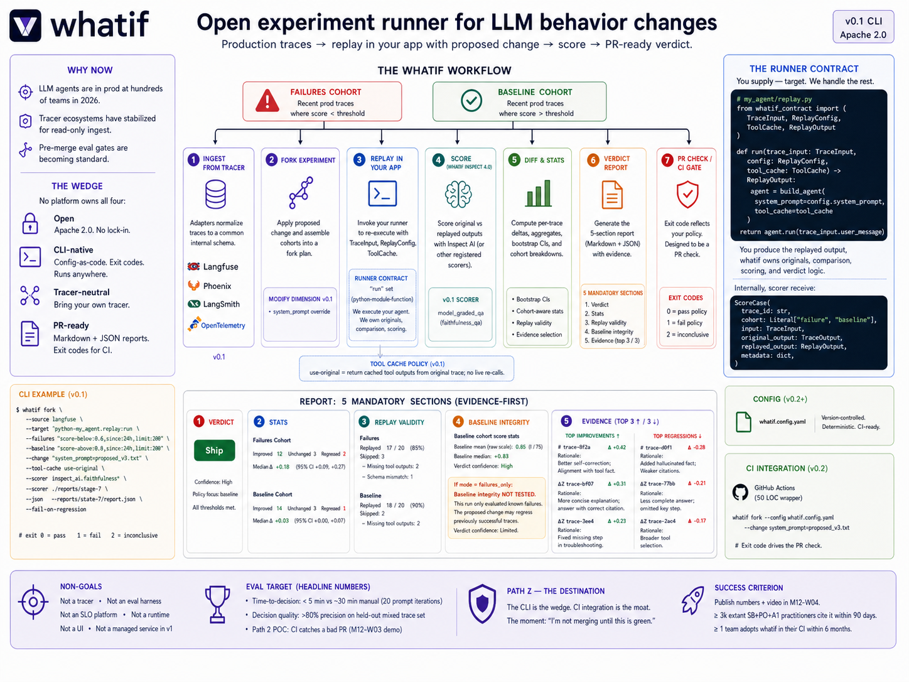
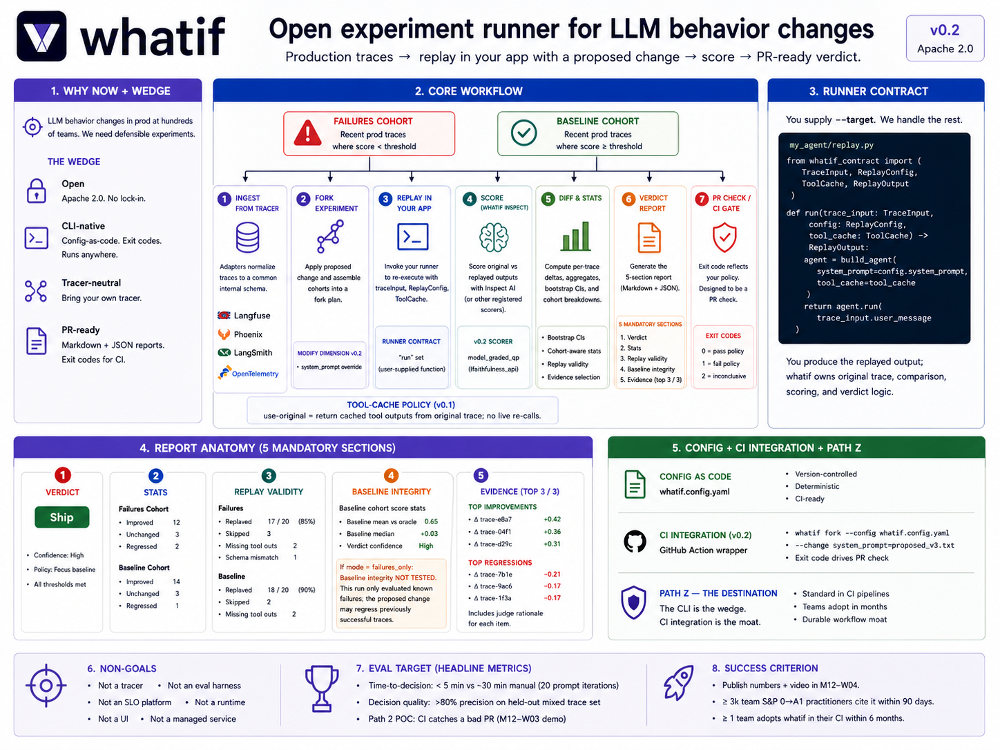

# whatif

[](https://github.com/victoralfred/whatif/actions/workflows/ci.yml)
[](https://opensource.org/licenses/Apache-2.0)
[](https://www.python.org/downloads/)
[](https://github.com/astral-sh/ruff)
[](#status)

> **whatif's product is the verdict's defensibility.** Fork production traces, replay with a proposed change, score the diff — and ship a Ship / Don't Ship / Inconclusive verdict a reviewer can read, follow the reasoning, and either trust or know exactly which assumption to challenge.



When you change a prompt, model, or tool in an LLM system, you don't actually know whether it improves behavior — you guess, with a handful of cherry-picked traces and inconsistent evaluation. Every step in the workflow has a tool: Langfuse for traces, Inspect AI for scoring, GitHub for PRs. **The experiment doesn't.**

**whatif** is the experiment runner. Fork production traces (failed cases plus a representative baseline), replay them with your proposed change (original tool outputs cached so side effects don't re-fire), score with the judge of your choice, and produce a Markdown + JSON verdict report you can attach to the PR. You stop shipping changes that fix one failure while silently regressing ten others. You go from *"this feels better"* to *"this improved 14/20, regressed 3 — here's exactly where, and here's the evidence I'd defend in review."*

**Stop shipping LLM changes on gut feel.**

---



## Status

**Pre-alpha; v0.1 release candidate.** The library API runs end-to-end against the synthetic stub adapter and against the real `whatif-langfuse` + `whatif-inspect-ai` adapters; the `whatif fork` CLI dispatcher is wired through the full factory → runner-loader → delta_fn → run_pipeline → render path. PyPI publication is pending.

| Version | Target | What it does |
|---|---|---|
| v0.1 | M10 (release candidate) | Langfuse ingest, prompt override, cached-tool replay, Inspect AI scorer, evidence-first Markdown + JSON reports, CI exit codes. |
| v0.2 | M11 | Stratified bootstrap CI, scorer cache wiring, second tracer adapter, model swap, GitHub Action wrapper. |
| v0.3 | M12 | Live-tool replay (opt-in, allowlist), worked CI sample repo. |
| v1.0 | year 2 | The pre-merge regression gate for LLM behavior. |

## Install

```bash
# Once published to PyPI:
uv pip install whatif whatif-langfuse whatif-inspect-ai

# From source (uv workspace):
git clone https://github.com/victoralfred/whatif
cd whatif
uv sync --all-extras --dev --group workspace
```

## Quickstart (programmatic — works today)

The library API is the load-bearing surface. A worked end-to-end example lives at [`docs/getting-started.md`](./docs/getting-started.md). Minimal shape:

```python
from whatif.adapters.stub import StubTraceSource, StubTraceSpec
from whatif.adapters.factory import build_scorer
from whatif.cli_pipeline import build_delta_fn
from whatif.config import ChangeConfig, ScorerConfig
from whatif.pipeline import run_pipeline
from whatif.runner_loader import load_runner

# Your runner satisfies the contract Protocol — see docs/runner-contract.md
loaded_runner = load_runner("python:my_agent.replay:run")

scorer = build_scorer(ScorerConfig(adapter="stub"))  # or wire a real Inspect AI scorer

trace_source = StubTraceSource(specs=[
    StubTraceSpec(trace_id="f-1", user_message="...", original_response="...", cohort="failure"),
    # ...
])

delta_fn = build_delta_fn(
    loaded_runner=loaded_runner,
    scorer=scorer,
    change=ChangeConfig(system_prompt="new prompt"),
    replay_timeout_seconds=60.0,
)

# Construct floor / policy / runtime / methodology / cache_summary,
# then call run_pipeline → ReportV01.
# Full worked example: docs/getting-started.md.
```

## Quickstart (CLI — stub adapters work today)

```bash
# Write a config:
cat > whatif.config.yaml <<EOF
source:
  adapter: stub
target:
  runner: python:examples.minimal_agent.replay:run
selection:
  failure_cohort: { limit: 5 }
  baseline_cohort: { limit: 5 }
change:
  system_prompt: my new prompt
scorer:
  adapter: stub
decision: {}
reporting: {}
timeouts: {}
EOF

# Run the fork:
uv run whatif fork --config whatif.config.yaml

# Exit codes:
#   0 = Ship verdict
#   1 = Don't Ship verdict
#   2 = Inconclusive verdict / setup failure / floor violation
```

Real Langfuse traces require `LANGFUSE_HOST` (or `LANGFUSE_BASE_URL`) + `LANGFUSE_PUBLIC_KEY` + `LANGFUSE_SECRET_KEY` in the environment. Real Inspect AI scoring requires the programmatic API in v0.1 (config-loaded `score_fn` is a v0.2 cascade entry — see [phases.md](./.claude/skills/whatif-design/references/phases.md)).

## How it composes

`whatif` doesn't replace your tracer or your eval framework — it composes them into an experiment.

- **Tracers (reads from)**: Langfuse (v0.1, real adapter shipped); Phoenix / LangSmith / OpenTelemetry GenAI (v0.2+).
- **Scorers (wraps)**: Inspect AI (v0.1, real adapter shipped); pluggable via the scorer registry.
- **Your agent (calls back into)**: any Python callable matching the [runner contract](./docs/runner-contract.md).
- **Downstream of `whatif`'s decisions**: your existing CI (GitHub Actions, GitLab CI), SLO platforms (Nobl9, Sloth, Honeycomb), incident tooling.

## What `whatif` is not

- Not a tracer (use Langfuse / Phoenix / LangSmith / OpenTelemetry GenAI).
- Not an offline eval harness (use Inspect AI / Promptfoo; whatif wraps them).
- Not an SLO platform (use Nobl9 / Sloth / Honeycomb downstream of whatif's decisions).
- Not an agent runtime — the runner contract is the boundary.
- Not a UI or dashboard.
- Not a substitute for production monitoring; not a benchmark suite; not a load test; not a causal estimator beyond replay association; not a judge-quality validator (see [docs/concepts.md](./docs/concepts.md)).

## Documentation

- **[`docs/concepts.md`](./docs/concepts.md)** — the conceptual model: defensible verdicts, non-claims, trust floor vs decision policy, failure-as-data, evidence and audit bundle
- **[`docs/getting-started.md`](./docs/getting-started.md)** — worked end-to-end example
- **[`docs/runner-contract.md`](./docs/runner-contract.md)** — the user-facing extension point reference
- **[`docs/schema/v0.1.md`](./docs/schema/v0.1.md)** — `ReportV01` consumer compatibility guide
- **[`docs/walkthroughs/`](./docs/walkthroughs/)** — six rendered scenarios as reference (Ship, Don't Ship, Inconclusive)
- **[`examples/minimal-agent/`](./examples/minimal-agent/)** — copy-paste reference Runner

## Design

The full design — problem framing, prior art, runner contract, report shape, eval target, milestones, risks — lives in [DESIGN.md](./DESIGN.md). The doctrine and cardinal rules are in [`.claude/skills/whatif-design/SKILL.md`](./.claude/skills/whatif-design/SKILL.md).

## Contributing

Pre-alpha. Issues and design discussion welcome; pull requests deferred until v0.1 ships.

## License

Apache 2.0. See [LICENSE](./LICENSE).
